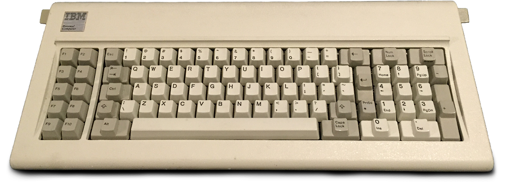

# nocap
Kernel patch series to allow eBPF programs to control input events.

## Why?
<p align="center">
  
  <p align="center">
      <i>IBM Model F Keyboard, Observe that the ctrl key is beside the A key. <b>They took this from you.</b></i>
  </p>
</p>

Remap `ctrl` over the caps lock key in a way that does not depend on the input read from `/dev/input/eventX`, meaning, your remapped `ctrl` will stay remapped, even when using a KVM guest, or when using the Linux console. Something similar exists under HID-BPF, but, it will only work for HID devices.

# Using:
To run a minimal Kernel with test programs use `make` as below, see [Building](##Building) before:
```shell
$ make run
```

## Building:
To make this work we require a custom Kernel.

### Busybox
Copy the config `configs/busybox/config` to `busybox/.config`:
```shell
$ cp configs/busybox/config busybox/.config
```
Build busybox (you will need the usual dependencies):
```shell
$ cd busybox
$ make
$ make install
```

### Linux:
Copy the `nocap_defconfig` to `arch/x86/config/`:
```shell
$ cp configs/linux/nocap_defconfig linux/arch/x86/config/
```
Build the Kernel (you will need the usual dependencies):
```shell
$ cd linux
$ make allnoconfig
$ make nocap_defconfig
$ make
$ make headers_install
```

### zstd
If your distro comes with `libzstd.a` skip this.
```
$ make
```

### Patching:
TODO:
